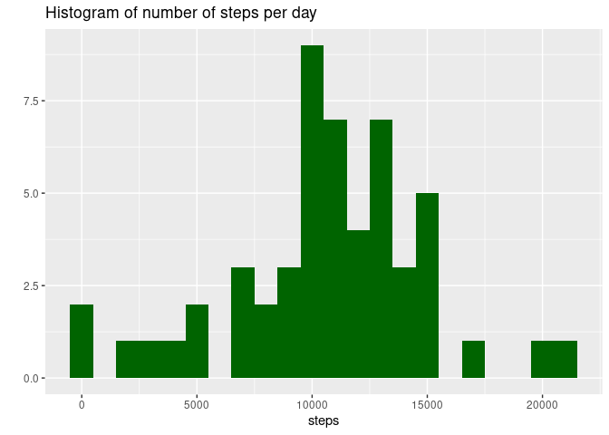
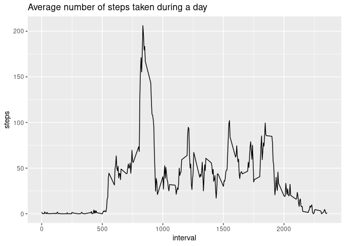
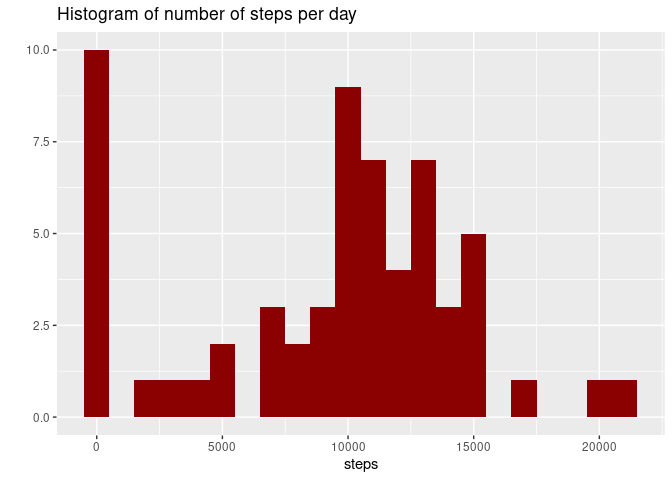
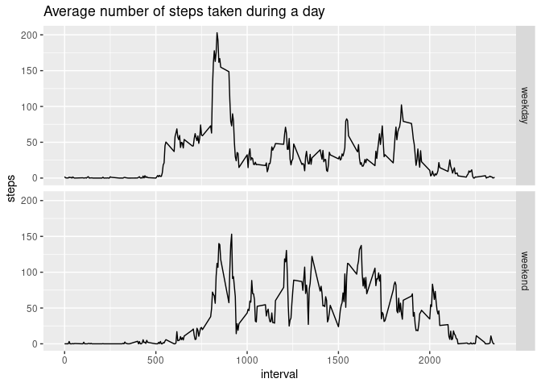

Pieter Kuijpers  
April 27, 2021

## Loading and preprocessing the data

The _readr_ library is used for reading the data straight from the zipfile.


```r
library(readr)
steps <- read_csv("activity.zip")
```

```
## 
## ── Column specification ────────────────────────────────────────────────────────
## cols(
##   steps = col_double(),
##   date = col_date(format = ""),
##   interval = col_double()
## )
```

The data consists of 17568 observations with three variables:

1. _steps_: Number of steps taking in a 5-minute interval (missing values are
	coded as `NA`)
2. _date_: The date on which the measurements was taken
3. _interval_: Identifier for the 5-minute interval in which the measurement
	was taken


```r
str(steps)
```

```
## spec_tbl_df[,3] [17,568 × 3] (S3: spec_tbl_df/tbl_df/tbl/data.frame)
##  $ steps   : num [1:17568] NA NA NA NA NA NA NA NA NA NA ...
##  $ date    : Date[1:17568], format: "2012-10-01" "2012-10-01" ...
##  $ interval: num [1:17568] 0 5 10 15 20 25 30 35 40 45 ...
##  - attr(*, "spec")=
##   .. cols(
##   ..   steps = col_double(),
##   ..   date = col_date(format = ""),
##   ..   interval = col_double()
##   .. )
```


```r
summary(steps)
```

```
##      steps             date               interval     
##  Min.   :  0.00   Min.   :2012-10-01   Min.   :   0.0  
##  1st Qu.:  0.00   1st Qu.:2012-10-16   1st Qu.: 588.8  
##  Median :  0.00   Median :2012-10-31   Median :1177.5  
##  Mean   : 37.38   Mean   :2012-10-31   Mean   :1177.5  
##  3rd Qu.: 12.00   3rd Qu.:2012-11-15   3rd Qu.:1766.2  
##  Max.   :806.00   Max.   :2012-11-30   Max.   :2355.0  
##  NA's   :2304
```
The _steps_ variable contains a significant number of NA's. It also has a lot
of values of 0. The observations are taken in october and november, 2012. The
_interval_ ranges from 0 to 2355. It seems like the interval counter is reset 
at the start of each day.

## What is mean total number of steps taken per day?

We are interested in the total number of steps taken each day. For this, the
data is grouped per day and summarized.


```r
library(dplyr)
```

```
## 
## Attaching package: 'dplyr'
```

```
## The following objects are masked from 'package:stats':
## 
##     filter, lag
```

```
## The following objects are masked from 'package:base':
## 
##     intersect, setdiff, setequal, union
```

```r
steps_per_day <- steps %>% 
	group_by(date) %>%
	summarize(steps=sum(steps))
```

```r
library(ggplot2)
qplot(steps, data = steps_per_day, binwidth=1000, 
      main="Histogram of number of steps per day",
      fill=I("darkgreen"))
```

```
## Warning: Removed 8 rows containing non-finite values (stat_bin).
```

<!-- -->


```r
summary(steps_per_day)
```

```
##       date                steps      
##  Min.   :2012-10-01   Min.   :   41  
##  1st Qu.:2012-10-16   1st Qu.: 8841  
##  Median :2012-10-31   Median :10765  
##  Mean   :2012-10-31   Mean   :10766  
##  3rd Qu.:2012-11-15   3rd Qu.:13294  
##  Max.   :2012-11-30   Max.   :21194  
##                       NA's   :8
```

The mean value of steps per day is **1.0766189\times 10^{4}**.

The median of number of steps per day is **1.0765\times 10^{4}**.


## What is the average daily activity pattern?

For this, we average the steps in each 5-min interval per day over all days.


```r
avg_steps <- steps %>% 
	group_by(interval) %>%
	summarize(steps=mean(steps, na.rm = TRUE))
```

Plotting the average number of steps against the 5-min intervals yields the
following graph:


```r
qplot(x=interval, y=steps, data = avg_steps, geom = "line",
      main="Average number of steps taken during a day")
```

<!-- -->

From the plot, it can be seen that the average number of steps is highest
somewhere betweeen intervals 500 and 1000.


```r
avg_steps[avg_steps$steps == max(avg_steps$steps),]
```

```
## # A tibble: 1 x 2
##   interval steps
##      <dbl> <dbl>
## 1      835  206.
```

It is highest at interval 835.

## Imputing missing values

The number of rows with missing values:


```r
sum(!complete.cases(steps))
```

```
## [1] 2304
```

How are these NA values distributed?


```r
summary(steps[!complete.cases(steps),])
```

```
##      steps           date               interval     
##  Min.   : NA    Min.   :2012-10-01   Min.   :   0.0  
##  1st Qu.: NA    1st Qu.:2012-10-26   1st Qu.: 588.8  
##  Median : NA    Median :2012-11-06   Median :1177.5  
##  Mean   :NaN    Mean   :2012-11-01   Mean   :1177.5  
##  3rd Qu.: NA    3rd Qu.:2012-11-11   3rd Qu.:1766.2  
##  Max.   : NA    Max.   :2012-11-30   Max.   :2355.0  
##  NA's   :2304
```

It appears that the NA's are distributed all over the date range and the
intervals. We'll use the `tidy::fill` function to replace the NA values with the
number of steps in the previous interval.


```r
library(tidyr)
steps_complete <- steps %>% fill(steps, .direction = "downup")
```


How does this affect the number of steps per day?


```r
steps_complete_per_day <- steps_complete %>% 
	group_by(date) %>%
	summarize(steps=sum(steps))
qplot(steps, data = steps_complete_per_day, binwidth=1000,
      main="Histogram of number of steps per day",
      fill=I("darkred"))
```

<!-- -->

```r
summary(steps_complete_per_day)
```

```
##       date                steps      
##  Min.   :2012-10-01   Min.   :    0  
##  1st Qu.:2012-10-16   1st Qu.: 6778  
##  Median :2012-10-31   Median :10395  
##  Mean   :2012-10-31   Mean   : 9354  
##  3rd Qu.:2012-11-15   3rd Qu.:12811  
##  Max.   :2012-11-30   Max.   :21194
```

After replacing the NA values, there are a lot more days with 0 steps. This is
also reflected in the mean number of steps, which has gone down compared with 
the data with NA's.

## Are there differences in activity patterns between weekdays and weekends?

Add a column `weekday` indicating if the date is on a weekend or a weekday.


```r
steps_weekday <- steps_complete %>% mutate(weekday=if_else(
	weekdays(steps_complete$date) %in% c("zaterdag", "zondag"), 
	"weekend", "weekday")) %>%
	mutate(weekday = as.factor(weekday))
```


```r
avg_steps_weekday <- steps_weekday %>% 
	group_by(interval, weekday) %>%
	summarize(steps=mean(steps, na.rm = TRUE), .groups = "keep")
qplot(x=interval, y=steps, data = avg_steps_weekday, geom = "line",
      facets = weekday~.,
      main="Average number of steps taken during a day")
```

<!-- -->

The plot shows that on a weekday, there is a high number of steps at the start
of the day and less activity afterward, while on a weekend the activity is more
equally distributed over the day. A possible explanation is that the subject 
travels to his/her work in the morning and spends the working day without much
walking.
